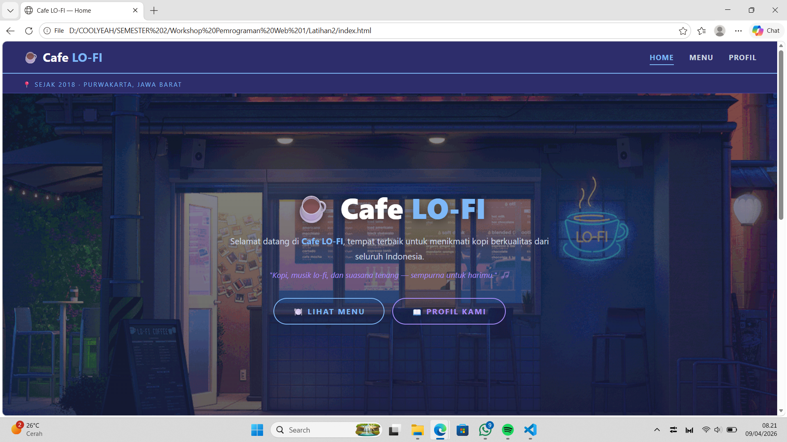
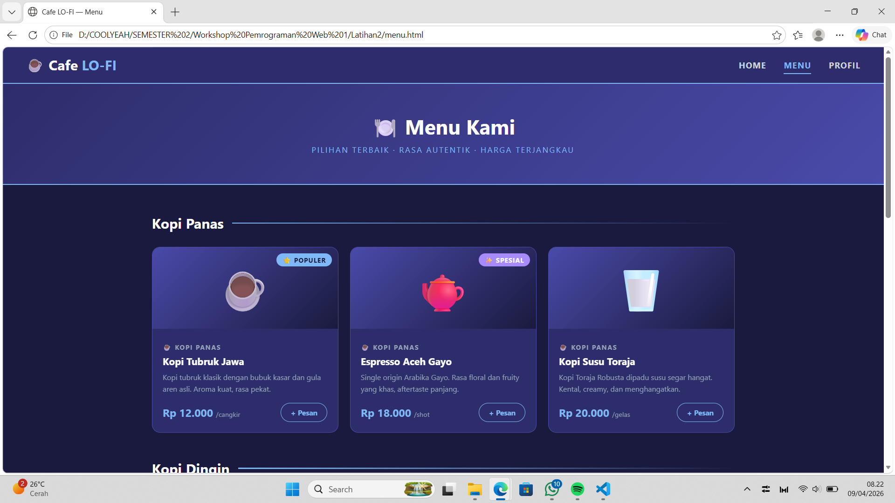
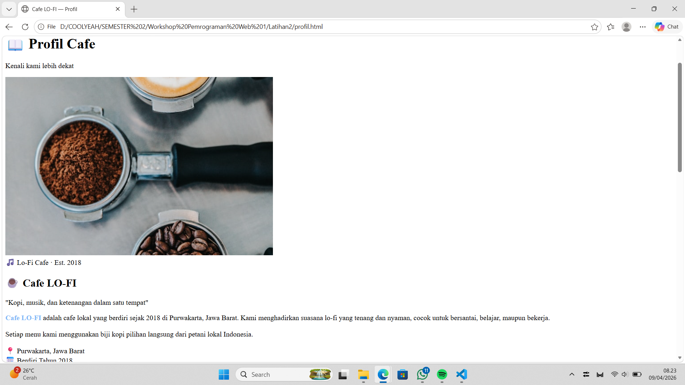

# ☕ Website Cafe — Mini Project Web

## 📖 Deskripsi

Project ini merupakan website cafe sederhana bertema **Lo-Fi** yang dibuat menggunakan HTML dan CSS sebagai bagian dari pembelajaran **Pemrograman Web 1**. Website ini terdiri dari tiga halaman utama yaitu Home, Menu, dan Profil, dengan tampilan biru gelap yang estetik dan modern.

---

## 🎯 Tujuan

Tujuan dari mini project ini adalah untuk memahami dan menerapkan dasar-dasar HTML dan CSS, seperti:

- Struktur halaman web dengan tag HTML yang benar
- Penggunaan tag `
`, ``, ``, dan lainnya
- Menerapkan **Inline CSS**, **Internal CSS**, dan **External CSS**
- Membuat tampilan rapi menggunakan `margin` dan `padding`
- Menggunakan warna tema yang konsisten antar halaman
- Membuat efek **hover** pada tombol dan elemen
- Menambahkan **animasi CSS** sederhana

---

## ✨ Fitur

* Halaman Home dengan hero section dan background gambar lo-fiHalaman Menu dengan 8 pilihan menu makanan dan minuman lengkap harga
-  Halaman Profil dengan info cafe, keunggulan, lokasi, dan jam buka
-  Tema warna konsisten biru gelap lo-fi di seluruh halaman
-  Efek hover pada tombol dan kartu menu
-  Animasi gambar saat hover dan saat halaman dimuat
-  Navigasi antar halaman yang terhubung
-  Penggunaan emoji untuk tampilan lebih menarik

---

## 📄 Halaman yang Dibuat

| File | Halaman | Jenis CSS |
|---|---|---|
| `index.html` | 🏠 Home | **Inline CSS** |
| `menu.html` | 🍽️ Menu | **Internal CSS** |
| `profil.html` | 📖 Profil | **External CSS** |
| `style-profil.css` | — | File CSS Eksternal |

---

## 🛠️ Teknologi yang Digunakan

- **HTML** — Struktur halaman web
- **CSS** — Styling, animasi, dan efek hover
  - Inline CSS (pada `index.html`)
  - Internal CSS (pada `menu.html`)
  - External CSS (pada `profil.html` → `style-profil.css`)

---

## 📷 Screenshots

### 📌 Halaman Home

### 📌 Halaman Menu

### 📌 Halaman Profil

---

## 📚 Konsep yang Diterapkan

| Konsep | Penerapan |
|---|---|
| Tag `
` | Layout kartu, section, wrapper |
| Tag `` | Highlight teks berwarna |
| Tag `` | Gambar di halaman Profil |
| Inline CSS | Seluruh styling di `index.html` |
| Internal CSS | Tag `<style>` di `menu.html` |
| External CSS | File `style-profil.css` untuk `profil.html` |
| Margin & Padding | Jarak antar elemen di semua halaman |
| Hover Effect | Tombol, kartu menu, gambar |
| CSS Animation | `fadeInUp`, `fadeInLeft`, zoom gambar |
| CSS Variables | Tema warna konsisten (`--biru-tua`, `--aksen`, dll.) |

---

## 👨‍💻 Author

- **Nama:** Rizkita Cahya Munggaran
- **NIM:** 202504021
- **Mata Kuliah:** Workshop Pemrograman Web 1
- **Dosen:** Musawarman
